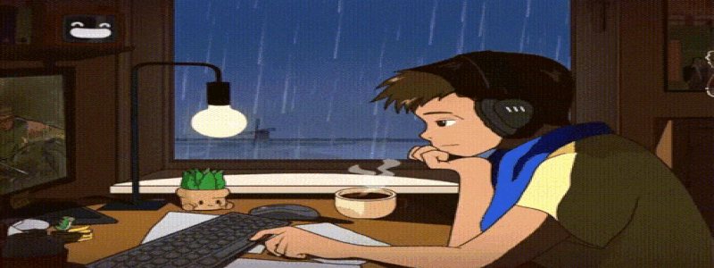
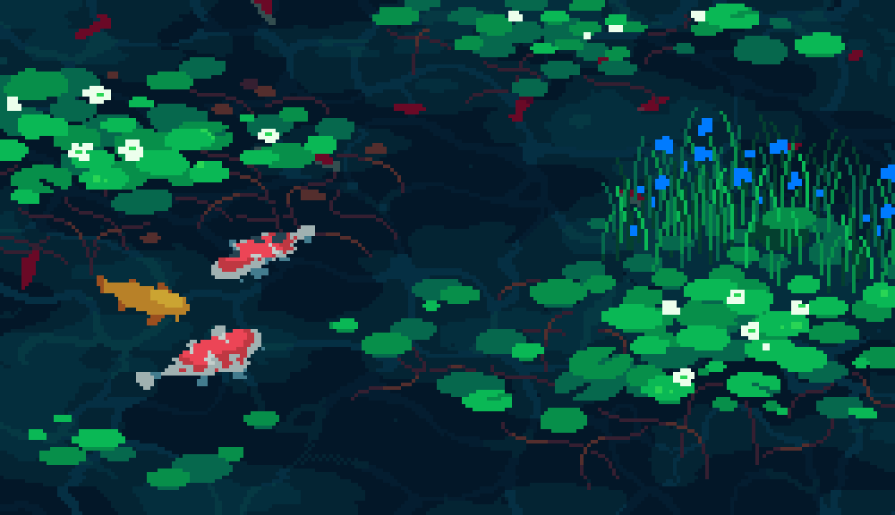
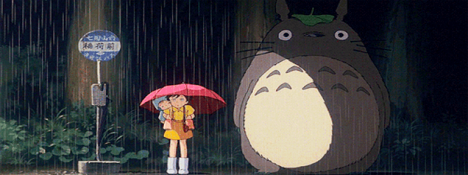

  <!-- Banner GIF (smaller, more subtle) -->
  

  <h1 style="font-family: 'Fira Mono', 'Consolas', monospace; font-size:2.2em; letter-spacing:0.04em; font-weight:700; color:#2C2A35; margin-bottom:0.2em;">lester pansoy</h1>
  
full-stack dev · koi dad · anime enjoyer

  

---

<!-- About Me (2 columns: gif left, info right) -->

  <table>
    <tr>
      <td align="center">
        
      </td>
      <td align="left" style="vertical-align:middle; padding-left:24px;">
        <h2 style="font-family:'Fira Mono',monospace; color:#8B7355; font-size:1.4em; margin-bottom:0.2em;">about me</h2>
        

          hey — i'm lester, a full-stack developer from the philippines. 
          i build things with javascript, nextjs, and lately, python.  
          when not at my desk, you'll find me watching anime, tending my koi pond, or learning something new at 2am.  
          i believe in clean code and slow mornings. ☕
        

      </td>
    </tr>
  </table>

---

<!-- Currently Brewing -->
<h2>currently brewing</h2>

🧪 learning: <b>Python</b>

---

<!-- Now Playing Section (2 columns: gif left, card right) -->

  <table>
    <tr>
      <td align="center" width="160">
         
        art by <a href="https://twitter.com/kirokaze">kirokaze</a>
      </td>
      <td align="center" style="vertical-align:middle;">
        <h3 style="font-family:'Fira Mono',monospace; color:#8B7355; font-size:1.1em; margin-bottom:0.2em;">now playing</h3>
        <!-- Replace the src below with your Spotify card when ready -->
        
      </td>
    </tr>
  </table>

---

<!-- Tech Stack -->
<h2>tech stack</h2>

---

<!-- Stats and Languages (GitHub Profile Summary Cards) -->

  <table>
    <tr>
      <td align="center" width="50%">
        
      </td>
      <td align="center" width="50%">
        
      </td>
    </tr>
  </table>

  

---

<!-- Streak Stats -->

  

---

<!-- Hobbies Row (2 columns) -->

  <table>
    <tr>
      <td align="center" width="50%">
         
        koi & goldfish dad
      </td>
      <td align="center" width="50%">
        <b>anime shelf</b> 
        (coming soon) 
        ✨
      </td>
    </tr>
  </table>

---

<!-- Footer -->

   
  "keep going, slowly" 🍵

